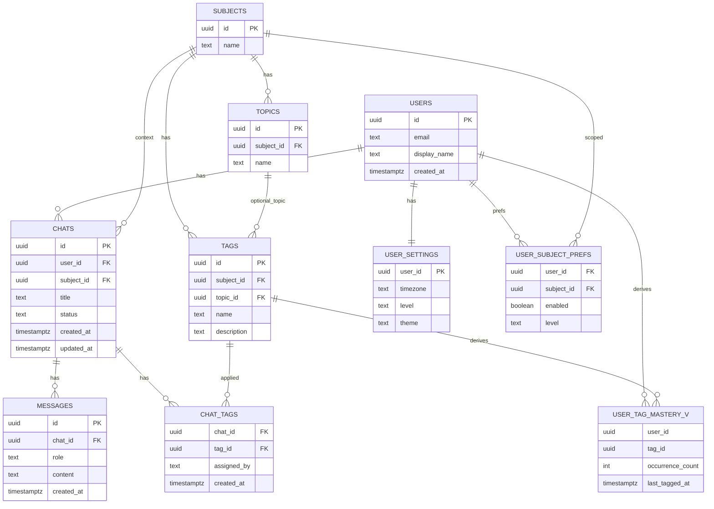

# プロトタイプ用データベース設計（最小機能）

- 対象RDBMS: PostgreSQL
- 目的: 最小機能の学習プロトタイプを短期間で実装するためのDB設計
- 範囲: users, subjects, topics, tags, chats, messages, chat_tags, user_tag_mastery(View), user_settings, user_subject_prefs
- 方針: 3NF 準拠を意識しつつ、将来拡張（最終仕様）への移行を容易にする
- ID: 主要エンティティは `uuid`（`gen_random_uuid()`）
- 時刻: `timestamptz`（UTC格納）

## ER 図（プロトタイプ）



## 列挙（論理定義）

DB実装は `TEXT + CHECK` で開始し、将来 `ENUM` へ移行可能とします。

### chat_status — チャット状態（開始/終了制御）

| 値 | 説明 | 主な用途 | 既定 | 備考 |
| --- | --- | --- | --- | --- |
| in_progress | 対話進行中（送受信可） | `chats.status` | ✓ | 新規作成時の既定値 |
| ended | 終了（送信不可） | `chats.status` |  | 終了後はメッセージ送信・AI呼出を禁止 |

### message_role — メッセージの役割

| 値 | 説明 | 主な用途 | 既定 | 備考 |
| --- | --- | --- | --- | --- |
| user | ユーザー発話 | `messages.role` | なし |  |
| assistant | 生徒AIの応答 | `messages.role` |  |  |
| system | システムメッセージ | `messages.role` |  | プロンプト等 |

### tag_assigned_by — タグの付与主体

| 値 | 説明 | 主な用途 | 既定 | 備考 |
| --- | --- | --- | --- | --- |
| ai | モデルにより自動付与 | `chat_tags.assigned_by` | ✓ |  |
| user | ユーザーが手動付与 | `chat_tags.assigned_by` |  |  |
| system | システム処理が付与 | `chat_tags.assigned_by` |  | バッチ等 |

---

## エンティティ仕様（用途と列定義）

### users — ユーザー

- 用途: アプリの主体。チャット、設定、タグ理解度など全データの所有者。
- 備考: プロトタイプでは IdP 連携情報は持たず、最小限のメール/表示名のみ。

| 列名 | 型 | 必須 | デフォルト | 説明 | 例 |
| --- | --- | --- | --- | --- | --- |
| id | uuid | 必須 | gen_random_uuid() | 主キー | 550e8400-e29b-41d4-a716-446655440000 |
| email | text | 必須 |  | メール（UNIQUE） | user@example.com |
| display_name | text | 任意 |  | 表示名 | 山田 太郎 |
| created_at | timestamptz | 必須 | now() | 作成日時 | 2025-09-12T12:00:00Z |

- 主キー: (id)
- 一意制約: (email)

### subjects — 科目

- 用途: 学習対象の上位カテゴリ。タグ/チャットの文脈に使用。

| 列名 | 型 | 必須 | デフォルト | 説明 | 例 |
| --- | --- | --- | --- | --- | --- |
| id | uuid | 必須 | gen_random_uuid() | 主キー | 6d3a… |
| name | text | 必須 |  | 科目名（UNIQUE） | 数学 |

- 主キー: (id)
- 一意制約: (name)

### topics — トピック（任意）

- 用途: 科目配下の細分化。タグ辞書の粒度向上や絞込に使用（未使用でも可）。

| 列名 | 型 | 必須 | デフォルト | 説明 | 例 |
| --- | --- | --- | --- | --- | --- |
| id | uuid | 必須 | gen_random_uuid() | 主キー | 0a12… |
| subject_id | uuid | 必須 |  | 科目ID（FK） | subjects.id |
| name | text | 必須 |  | トピック名 | 条件付き確率 |

- 主キー: (id)
- 外部キー: (subject_id) → subjects(id) ON DELETE CASCADE
- 一意制約: (subject_id, name)

### tags — タグ辞書（簡易）

- 用途: 学習/誤解のテーマ。プロトタイプでは `tag_types` を持たない。

| 列名 | 型 | 必須 | デフォルト | 説明 | 例 |
| --- | --- | --- | --- | --- | --- |
| id | uuid | 必須 | gen_random_uuid() | 主キー | 9f21… |
| subject_id | uuid | 必須 |  | 科目ID（FK） | subjects.id |
| topic_id | uuid | 任意 |  | トピックID（FK、NULL可） | topics.id |
| name | text | 必須 |  | テーマ名 | ベイズの定理 |
| description | text | 任意 |  | 補足説明 | 条件付き確率に基づく定理 |

- 主キー: (id)
- 外部キー: (subject_id) → subjects(id) ON DELETE CASCADE
- 外部キー: (topic_id) → topics(id) ON DELETE SET NULL
- 一意制約: (subject_id, name)

### chats — チャットセッション（簡易）

- 用途: 会話セッションの単位。状態列は省略し、最小構成とする。
  - 変更: 状態列 `status` を追加（開始/終了の制御に使用）。

| 列名 | 型 | 必須 | デフォルト | 説明 | 例 |
| --- | --- | --- | --- | --- | --- |
| id | uuid | 必須 | gen_random_uuid() | 主キー | 1c34… |
| user_id | uuid | 必須 |  | ユーザーID（FK） | users.id |
| subject_id | uuid | 任意 |  | 科目ID（FK、NULL可） | subjects.id |
| title | text | 必須 | '新しいチャット' | タイトル | ベイズ直感の練習 |
| status | text | 必須 | 'in_progress' | チャット状態（`chat_status`） | in_progress |
| created_at | timestamptz | 必須 | now() | 作成日時 | 2025-09-12T12:00:00Z |
| updated_at | timestamptz | 必須 | now() | 更新日時 | 2025-09-12T12:00:00Z |

- 主キー: (id)
- 外部キー: (user_id) → users(id) ON DELETE CASCADE
- 外部キー: (subject_id) → subjects(id) ON DELETE SET NULL
- 推奨インデックス: (user_id, status, updated_at DESC)
- 推奨CHECK: `status IN ('in_progress','ended')`

### messages — 会話メッセージ

- 用途: 発話ログ。UI表示・タグ抽出の入力。

| 列名 | 型 | 必須 | デフォルト | 説明 | 例 |
| --- | --- | --- | --- | --- | --- |
| id | uuid | 必須 | gen_random_uuid() | 主キー | 7b89… |
| chat_id | uuid | 必須 |  | チャットID（FK） | chats.id |
| role | text | 必須 |  | 役割（`message_role`） | user |
| content | text | 必須 |  | 本文 | 事前確率と尤度の違いは… |
| created_at | timestamptz | 必須 | now() | 作成日時 | 2025-09-12T12:01:00Z |

- 主キー: (id)
- 外部キー: (chat_id) → chats(id) ON DELETE CASCADE
- 推奨インデックス: (chat_id, created_at)

### chat_tags — チャット付与タグ（多対多・簡易）

- 用途: 会話から抽出したタグの付与結果。`confidence` は持たない。

| 列名 | 型 | 必須 | デフォルト | 説明 | 例 |
| --- | --- | --- | --- | --- | --- |
| chat_id | uuid | 必須 |  | チャットID（FK） | chats.id |
| tag_id | uuid | 必須 |  | タグID（FK） | tags.id |
| assigned_by | text | 必須 | 'ai' | 付与主体（`tag_assigned_by`） | ai |
| created_at | timestamptz | 必須 | now() | 作成日時 | 2025-09-12T12:02:00Z |

- 主キー: (chat_id, tag_id)
- 外部キー: (chat_id) → chats(id) ON DELETE CASCADE
- 外部キー: (tag_id) → tags(id)
- 推奨インデックス: (tag_id)

### user_tag_mastery_v — 理解度ビュー（推奨）

- 方針: プロトタイプでは計算結果を即時反映するため **VIEW** を採用（集計は軽量）。将来はマテビュー or テーブル化を検討。
- 用途: ユーザー×タグの出現回数から簡易的な理解度指標を得る。
- 定義（例）:

```sql
CREATE VIEW user_tag_mastery_v AS
SELECT
  c.user_id,
  ct.tag_id,
  COUNT(*)::int AS occurrence_count,
  MAX(c.updated_at) AS last_tagged_at
FROM chat_tags ct
JOIN chats c ON c.id = ct.chat_id
GROUP BY c.user_id, ct.tag_id;
```

- 取得例: 「最近タグ付けされた順」「出現数が多い順」等のランキングに利用。

### user_settings — ユーザー設定（通知関連除外）

- 用途: 最小限の個人設定（タイムゾーン/難易度/テーマ）。通知時間帯等は未実装。

| 列名 | 型 | 必須 | デフォルト | 説明 | 例 |
| --- | --- | --- | --- | --- | --- |
| user_id | uuid | 必須 |  | 主キー＝FK（users） | users.id |
| timezone | text | 必須 | 'Asia/Tokyo' | タイムゾーン | Asia/Tokyo |
| level | text | 必須 | 'normal' | 難易度 | normal |
| theme | text | 必須 | 'system' | テーマ | dark |

- 主キー: (user_id)
- 外部キー: (user_id) → users(id) ON DELETE CASCADE

### user_subject_prefs — ユーザー科目設定

- 用途: 科目の有効/難易度設定。対象範囲の絞り込みに使用。

| 列名 | 型 | 必須 | デフォルト | 説明 | 例 |
| --- | --- | --- | --- | --- | --- |
| user_id | uuid | 必須 |  | ユーザーID（FK） | users.id |
| subject_id | uuid | 必須 |  | 科目ID（FK） | subjects.id |
| enabled | boolean | 必須 | true | 有効/無効 | true |
| level | text | 任意 |  | 科目別難易度 | basic |

- 主キー: (user_id, subject_id)
- 外部キー: (user_id) → users(id) ON DELETE CASCADE
- 外部キー: (subject_id) → subjects(id) ON DELETE CASCADE

---

## 差分（最終仕様 → プロトタイプ）

- 省略: `tag_types`, `messages.meta`, `chat_tags.confidence`, `notification*`, `recall*`, `achievements*`
- 変更: `user_settings` から通知時間帯/上限を削除（`timezone/level/theme` のみ）
- 新設: `user_tag_mastery_v` を VIEW として導入（将来テーブル化可能）

## 推奨インデックス（プロトタイプ）

- `chats(user_id, updated_at DESC)`
- `messages(chat_id, created_at)`
- `chat_tags(tag_id)`
- `tags(subject_id, name)`（UNIQUE）
- `topics(subject_id, name)`（UNIQUE）
- `user_subject_prefs(user_id)`

```text
注意: まずは最小構成で進め、負荷/需要に応じて最終仕様へ拡張（列挙のENUM化、再想起、通知、実績など）
```
