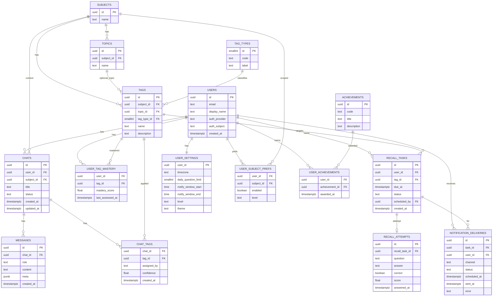

# データベース詳細仕様

- 対象RDBMS: PostgreSQL
- ID方針: 主要エンティティは `uuid`（`gen_random_uuid()`）
- タイムスタンプ: `timestamptz`（UTC格納）
- 文字コード: UTF-8
- 参考: 本文中のER図

## ER 図

## 列挙（論理定義）

列挙はアプリ論理での区分。DB実装は PostgreSQL の `ENUM` もしくは `TEXT + CHECK` を推奨します。

### message_role — メッセージの役割

| 値 | 説明 | 主な用途 | 既定 | 備考 |
| --- | --- | --- | --- | --- |
| user | ユーザー発話 | `messages.role` | なし |  |
| assistant | 生徒AIの応答 | `messages.role` |  |  |
| system | システムメッセージ | `messages.role` |  | プロンプト注入/指示など |

### chat_status — チャット状態

| 値 | 説明 | 主な用途 | 既定 | 備考 |
| --- | --- | --- | --- | --- |
| in_progress | 対話進行中 | `chats.status` | ✓ |  |
| done_ask_later | いったん終了（後で再質問） | `chats.status` |  | 再想起の起点になり得る |
| done_understood | 理解済みとして終了 | `chats.status` |  | 以降の再質問抑制の参考 |

### tag_assigned_by — タグの付与主体

| 値 | 説明 | 主な用途 | 既定 | 備考 |
| --- | --- | --- | --- | --- |
| ai | モデルにより自動付与 | `chat_tags.assigned_by` | ✓ |  |
| user | ユーザーが手動付与 | `chat_tags.assigned_by` |  |  |
| system | システム処理が付与 | `chat_tags.assigned_by` |  | バッチ/管理画面等 |

### recall_task_status — 再想起タスクの状態

| 値 | 説明 | 主な用途 | 既定 | 備考 |
| --- | --- | --- | --- | --- |
| scheduled | 予約済み | `recall_tasks.status` | ✓ | 実行待ち |
| queued | キュー投入済み | `recall_tasks.status` |  | ジョブ実行直前 |
| sent | 出題/通知を送信済み | `recall_tasks.status` |  |  |
| answered | 解答済み | `recall_tasks.status` |  | `recall_attempts` あり |
| canceled | 取消 | `recall_tasks.status` |  | ユーザー操作/条件変更 |
| expired | 時間切れ | `recall_tasks.status` |  | 出題期限超過 |
| failed | 失敗 | `recall_tasks.status` |  | 再試行対象 |

### delivery_channel — 通知チャネル

| 値 | 説明 | 主な用途 | 既定 | 備考 |
| --- | --- | --- | --- | --- |
| webpush | Web Push 配信 | `notification_deliveries.channel` | ✓ | VAPID |
| email | メール配信 | `notification_deliveries.channel` |  | Azure Communication Services 等 |

### delivery_status — 通知の配送状態

| 値 | 説明 | 主な用途 | 既定 | 備考 |
| --- | --- | --- | --- | --- |
| scheduled | 送信予定 | `notification_deliveries.status` | ✓ |  |
| sent | 送信済み | `notification_deliveries.status` |  |  |
| failed | 失敗 | `notification_deliveries.status` |  | 再試行/アラート |
| canceled | 取消 | `notification_deliveries.status` |  | ユーザー/システム都合 |

---

## users — ユーザー

用途: 認証連携（NextAuth/IdP）とアプリ内の主体。各種リソースの所有者。画面: ログイン（SCR-001）、全ページの認可判定。API: `/api/auth/*`、アプリ内部の Server Actions。

| 列名 | 型 | 必須 | デフォルト | 説明 | 例 |
| --- | --- | --- | --- | --- | --- |
| id | uuid | 必須 | gen_random_uuid() | 主キー | 550e8400-e29b-41d4-a716-446655440000 |
| auth_provider | text | 必須 |  | IdP識別子（entra/google 等） | entra |
| auth_subject | text | 必須 |  | IdP内ユニークな subject | a1b2c3d4 |
| email | text | 任意 |  | メールアドレス（UNIQUE） | user@example.com |
| display_name | text | 任意 |  | 表示名 | 田中 太郎 |
| created_at | timestamptz | 必須 | now() | 作成日時 | 2025-09-12T12:00:00Z |

- 主キー: (id)
- 一意制約: (auth_provider, auth_subject), (email)

---

## subjects — 科目

用途: 学習対象の上位区分。設定画面（SCR-004）で対象科目の選択、チャットの絞り込み、タグ辞書のスコープに使用。ダッシュボードの集計軸。

| 列名 | 型 | 必須 | デフォルト | 説明 | 例 |
| --- | --- | --- | --- | --- | --- |
| id | uuid | 必須 | gen_random_uuid() | 主キー | 6d3a… |
| name | text | 必須 |  | 科目名（UNIQUE） | 数学 |

- 主キー: (id)
- 一意制約: (name)

---

## topics — トピック（任意）

用途: 科目配下の細分化カテゴリ。タグ辞書の粒度を高める用途。将来の出題範囲指定/分析で使用（任意導入）。

| 列名 | 型 | 必須 | デフォルト | 説明 | 例 |
| --- | --- | --- | --- | --- | --- |
| id | uuid | 必須 | gen_random_uuid() | 主キー | 0a12… |
| subject_id | uuid | 必須 |  | 科目ID（FK） | subjects.id |
| name | text | 必須 |  | トピック名 | 条件付き確率 |

- 主キー: (id)
- 外部キー: (subject_id) → subjects(id) ON DELETE CASCADE
- 一意制約: (subject_id, name)

---

## tag_types — タグ類型マスタ

用途: 誤解タグの類型（定義/条件/境界/根拠/手順 等）の辞書。UIのバッジ表示やフィルタ、分析で使用。

| 列名 | 型 | 必須 | デフォルト | 説明 | 例 |
| --- | --- | --- | --- | --- | --- |
| id | smallint | 必須 |  | 主キー | 1 |
| code | text | 必須 |  | システムコード（UNIQUE） | definition |
| label | text | 必須 |  | 表示名 | 定義 |

- 主キー: (id)
- 一意制約: (code)

---

## tags — タグ辞書

用途: 誤解・学習テーマの辞書。チャットへの付与（`chat_tags`）、ユーザー理解度（`user_tag_mastery`）、再想起（`recall_tasks`）の対象軸。UIのタグチップ表示。

| 列名 | 型 | 必須 | デフォルト | 説明 | 例 |
| --- | --- | --- | --- | --- | --- |
| id | uuid | 必須 | gen_random_uuid() | 主キー | 9f21… |
| subject_id | uuid | 必須 |  | 科目ID（FK） | subjects.id |
| topic_id | uuid | 任意 |  | トピックID（FK、NULL可） | topics.id |
| tag_type_id | smallint | 必須 |  | タグ類型（FK） | tag_types.id |
| name | text | 必須 |  | テーマ名 | ベイズの定理 |
| description | text | 任意 |  | 補足説明 | 条件付き確率に基づく定理 |

- 主キー: (id)
- 外部キー: (subject_id) → subjects(id) ON DELETE CASCADE
- 外部キー: (topic_id) → topics(id) ON DELETE SET NULL
- 外部キー: (tag_type_id) → tag_types(id)
- 一意制約: (subject_id, name)

---

## chats — チャットセッション

用途: 会話セッションの単位。サイドバー一覧（SCR-002）、チャット画面（SCR-003）で使用。状態は学習フローの進行管理に使用。

| 列名 | 型 | 必須 | デフォルト | 説明 | 例 |
| --- | --- | --- | --- | --- | --- |
| id | uuid | 必須 | gen_random_uuid() | 主キー | 1c34… |
| user_id | uuid | 必須 |  | ユーザーID（FK） | users.id |
| subject_id | uuid | 任意 |  | 科目ID（FK、NULL可） | subjects.id |
| title | text | 必須 | '新しいチャット' | タイトル | ベイズ直感の練習 |
| status | text | 必須 | 'in_progress' | セッション状態（enum相当） | in_progress |
| created_at | timestamptz | 必須 | now() | 作成日時 | 2025-09-12T12:00:00Z |
| updated_at | timestamptz | 必須 | now() | 更新日時 | 2025-09-12T12:00:00Z |

- 主キー: (id)
- 外部キー: (user_id) → users(id) ON DELETE CASCADE
- 外部キー: (subject_id) → subjects(id) ON DELETE SET NULL
- 推奨インデックス: (user_id, updated_at DESC)

---

## messages — 会話メッセージ

用途: チャットの発話ログ。チャット画面表示、タグ抽出/分析の入力、履歴保存に使用。

| 列名 | 型 | 必須 | デフォルト | 説明 | 例 |
| --- | --- | --- | --- | --- | --- |
| id | uuid | 必須 | gen_random_uuid() | 主キー | 7b89… |
| chat_id | uuid | 必須 |  | チャットID（FK） | chats.id |
| role | text | 必須 |  | 役割（enum相当） | user |
| content | text | 必須 |  | 本文 | 事前確率と尤度の違いは… |
| meta | jsonb | 必須 | '{}' | 補助メタ（トークン数等） | {"tokens": 128} |
| created_at | timestamptz | 必須 | now() | 作成日時 | 2025-09-12T12:01:00Z |

- 主キー: (id)
- 外部キー: (chat_id) → chats(id) ON DELETE CASCADE
- 推奨インデックス: (chat_id, created_at)

---

## chat_tags — チャット付与タグ（多対多）

用途: 会話から抽出したタグの付与結果。UIのタグ表示、理解度集計、再想起タスク生成の根拠に使用。

| 列名 | 型 | 必須 | デフォルト | 説明 | 例 |
| --- | --- | --- | --- | --- | --- |
| chat_id | uuid | 必須 |  | チャットID（FK） | chats.id |
| tag_id | uuid | 必須 |  | タグID（FK） | tags.id |
| assigned_by | text | 必須 | 'ai' | 付与主体（enum相当） | ai |
| confidence | real | 必須 | 0.0 | 確信度（0.0〜1.0） | 0.72 |
| created_at | timestamptz | 必須 | now() | 作成日時 | 2025-09-12T12:02:00Z |

- 主キー: (chat_id, tag_id)
- 外部キー: (chat_id) → chats(id) ON DELETE CASCADE
- 外部キー: (tag_id) → tags(id)
- 推奨インデックス: (tag_id)

---

## user_tag_mastery — ユーザー×タグ理解度

用途: ユーザーの理解度プロファイル。ダッシュボード/出題制御（閾値判定）、再想起間隔の決定に使用。更新はバッチ/イベントで反映。

| 列名 | 型 | 必須 | デフォルト | 説明 | 例 |
| --- | --- | --- | --- | --- | --- |
| user_id | uuid | 必須 |  | ユーザーID（FK） | users.id |
| tag_id | uuid | 必須 |  | タグID（FK） | tags.id |
| mastery_score | real | 必須 |  | 理解度（0〜1） | 0.35 |
| last_assessed_at | timestamptz | 任意 |  | 最終評価日時 | 2025-09-12T12:10:00Z |

- 主キー: (user_id, tag_id)
- 外部キー: (user_id) → users(id) ON DELETE CASCADE
- 外部キー: (tag_id) → tags(id) ON DELETE CASCADE
- 推奨インデックス: (user_id), (tag_id)

---

## recall_tasks — 再想起タスク

用途: 後日出題の予約。通知配信（`notification_deliveries`）と出題/解答（`recall_attempts`）のハブ。ジョブスケジューラで処理。

| 列名 | 型 | 必須 | デフォルト | 説明 | 例 |
| --- | --- | --- | --- | --- | --- |
| id | uuid | 必須 | gen_random_uuid() | 主キー | 2de4… |
| user_id | uuid | 必須 |  | ユーザーID（FK） | users.id |
| tag_id | uuid | 必須 |  | タグID（FK） | tags.id |
| due_at | timestamptz | 必須 |  | 予定時刻 | 2025-09-14T20:00:00Z |
| status | text | 必須 | 'scheduled' | タスク状態（enum相当） | scheduled |
| scheduled_by | uuid | 任意 |  | 起点チャットID（FK） | chats.id |
| created_at | timestamptz | 必須 | now() | 作成日時 | 2025-09-12T12:05:00Z |

- 主キー: (id)
- 外部キー: (user_id) → users(id) ON DELETE CASCADE
- 外部キー: (tag_id) → tags(id) ON DELETE CASCADE
- 外部キー: (scheduled_by) → chats(id) ON DELETE SET NULL
- 一意制約: (user_id, tag_id, due_at)
- 推奨インデックス: (user_id, due_at, status)

---

## recall_attempts — 再想起の出題と回答

用途: 再想起の実施結果。スコア/正誤で `user_tag_mastery` 更新の入力に使用。履歴表示やレポートにも利用可能。

| 列名 | 型 | 必須 | デフォルト | 説明 | 例 |
| --- | --- | --- | --- | --- | --- |
| id | uuid | 必須 | gen_random_uuid() | 主キー | 4ff0… |
| recall_task_id | uuid | 必須 |  | 再想起タスクID（FK） | recall_tasks.id |
| question | text | 必須 |  | 出題文 | ベイズの定理の式を書いてください |
| answer | text | 任意 |  | 回答文 | P(A|B)=… |
| correct | boolean | 任意 |  | 正誤 | true |
| score | real | 任意 |  | スコア（0〜1） | 0.8 |
| answered_at | timestamptz | 任意 |  | 回答日時 | 2025-09-14T20:05:00Z |

- 主キー: (id)
- 外部キー: (recall_task_id) → recall_tasks(id) ON DELETE CASCADE
- 一意制約: (recall_task_id)

---

## notification_deliveries — 通知配送

用途: Web Push/Email 送信のトラッキング。配信状況の監視・再試行・障害解析に使用。通知設定/時間帯と連動。

| 列名 | 型 | 必須 | デフォルト | 説明 | 例 |
| --- | --- | --- | --- | --- | --- |
| id | uuid | 必須 | gen_random_uuid() | 主キー | 3ac1… |
| task_id | uuid | 任意 |  | 紐付タスクID（FK、NULL可） | recall_tasks.id |
| user_id | uuid | 必須 |  | ユーザーID（FK） | users.id |
| channel | text | 必須 | 'webpush' | 配信チャネル（enum相当） | email |
| status | text | 必須 | 'scheduled' | 配信状態（enum相当） | sent |
| scheduled_at | timestamptz | 必須 |  | 予定時刻 | 2025-09-14T19:59:00Z |
| sent_at | timestamptz | 任意 |  | 送信時刻 | 2025-09-14T20:00:02Z |
| error | text | 任意 |  | エラー詳細 | SMTP timeout |

- 主キー: (id)
- 外部キー: (task_id) → recall_tasks(id) ON DELETE SET NULL
- 外部キー: (user_id) → users(id) ON DELETE CASCADE

---

## user_settings — ユーザー設定（1:1）

用途: タイムゾーン、1日の上限、通知時間帯、難易度、テーマなどの個人設定。再想起スケジュールとUIに反映。

| 列名 | 型 | 必須 | デフォルト | 説明 | 例 |
| --- | --- | --- | --- | --- | --- |
| user_id | uuid | 必須 |  | 主キー＝FK（users） | users.id |
| timezone | text | 必須 | 'Asia/Tokyo' | タイムゾーン | Asia/Tokyo |
| daily_question_limit | smallint | 必須 | 5 | 1日の出題上限（1〜50） | 5 |
| notify_window_start | time | 必須 | '19:00' | 通知開始時刻 | 19:00 |
| notify_window_end | time | 必須 | '22:00' | 通知終了時刻 | 22:00 |
| level | text | 必須 | 'normal' | 難易度 | normal |
| theme | text | 必須 | 'system' | テーマ | dark |

- 主キー: (user_id)
- 外部キー: (user_id) → users(id) ON DELETE CASCADE

---

## user_subject_prefs — ユーザー科目設定

用途: 科目ごとの有効/難易度設定。対象範囲の絞り込み、再想起の候補選定に使用。

| 列名 | 型 | 必須 | デフォルト | 説明 | 例 |
| --- | --- | --- | --- | --- | --- |
| user_id | uuid | 必須 |  | ユーザーID（FK） | users.id |
| subject_id | uuid | 必須 |  | 科目ID（FK） | subjects.id |
| enabled | boolean | 必須 | true | 有効/無効 | true |
| level | text | 任意 |  | 科目別難易度 | basic |

- 主キー: (user_id, subject_id)
- 外部キー: (user_id) → users(id) ON DELETE CASCADE
- 外部キー: (subject_id) → subjects(id) ON DELETE CASCADE

---

## achievements — 実績マスタ

用途: 実績の定義。UIのバッジ/トロフィー表示、モチベーション向上に使用。運用で追加入替。

| 列名 | 型 | 必須 | デフォルト | 説明 | 例 |
| --- | --- | --- | --- | --- | --- |
| id | uuid | 必須 | gen_random_uuid() | 主キー | 8e77… |
| code | text | 必須 |  | コード（UNIQUE） | streak_7 |
| title | text | 必須 |  | タイトル | 7日連続クリア |
| description | text | 任意 |  | 説明 | 1日1問を7日連続達成 |

- 主キー: (id)
- 一意制約: (code)

---

## user_achievements — 実績付与履歴

用途: 実績の付与ログ。プロフィール/実績画面表示、重複付与抑止のための一意制約に使用。

| 列名 | 型 | 必須 | デフォルト | 説明 | 例 |
| --- | --- | --- | --- | --- | --- |
| user_id | uuid | 必須 |  | ユーザーID（FK） | users.id |
| achievement_id | uuid | 必須 |  | 実績ID（FK） | achievements.id |
| awarded_at | timestamptz | 必須 | now() | 付与日時 | 2025-09-12T12:20:00Z |

- 主キー: (user_id, achievement_id)
- 外部キー: (user_id) → users(id) ON DELETE CASCADE
- 外部キー: (achievement_id) → achievements(id) ON DELETE CASCADE

---

## 補足事項

- 監査・削除ポリシー: 個人情報最小化。削除は `ON DELETE CASCADE/SET NULL` を適切に設定。
- 時刻の扱い: すべてUTC格納、アプリ層でユーザーTZへ変換。
- パフォーマンス: 推奨インデックスを適用し、必要に応じてクエリプロファイルで追加。
- 進化: `topics` は任意のため、初期は未使用でも良い。`user_tag_mastery` は派生保持であり、バッチで更新可能。
