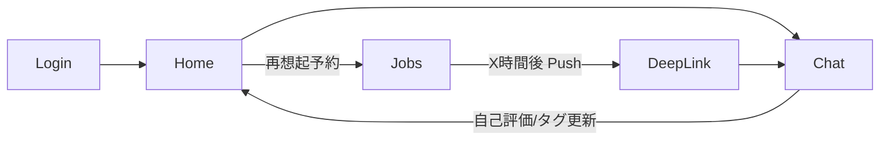

# モバイル版 要件定義書（iOS / Android）v1.2（確定版）

## 0. 差分サマリ（Web → モバイル）

* **UI / 実装**：Web（Next.js）→ **React Native + Expo（New Architecture / Hermes 前提）** によるネイティブ UI。
* **API 方針**：Web の「外部公開 API なし」→ **Mobile BFF（外部公開 REST / tRPC）** を新設し、**Bearer（AppJWT）** 認証を導入（Web の Cookie 認証は継続）。
* **認証**：OIDC（認可コード + PKCE）を**システムブラウザ**で実施 → BFF が **AppJWT（短命 15 分）＋ Refresh Token（30 日・device\_id 紐付け・ローテーション）** を発行。
* **通知**：Web Push 中心 → **APNs / FCM** を主軸化（Azure Notification Hubs 経由）。
* **課金**：B2C サブスク（Basic / Pro）は\*\*アプリ内課金（IAP / サブスク）\*\*に準拠。サーバで整合、**RevenueCat 採用**。
* **CI / CD**：Web は Docker / コンテナ配信を踏襲。モバイルは **EAS Build / Submit / Updates**。
* **DB 追加**：既存スキーマ共用に加え、`push_tokens` / `devices` / `iap_receipts` を新設。
* **ドメイン / CORS**：

  * Web（Cookie）：`https://app.example.com`
  * Mobile BFF（Bearer / CORS allow-list）：`https://api.example.com`（Stg は `https://api.stg.example.com`）
  * `Allow-Credentials: false`、`Authorization, Content-Type` を許可。
* **モノレポ**：`apps/web` `apps/mobile` `packages/*`（npm workspaces）を採用。

---

## 1. 目的・背景

学習者が**説明 → 問い返し → 自己評価 → タグ更新 → 再想起**のサイクルを短時間・高頻度で回せるよう、モバイルの常時携帯性と Push を活かして学習定着を最大化することを目的とする。

---

## 2. スコープ

### 2.1 対象（In Scope）

* iOS / Android ネイティブアプリ（ストア配信）。
* 生徒 AI との対話、誤解タグ化、再想起、履歴、設定、サブスク管理。
* Push 通知による再想起（DeepLink 復帰で対象チャットを即起動）。

### 2.2 非対象（Out of Scope, v1.2）

* 画像・音声・動画の入出力。
* 学校 / 組織向け B2B 管理機能。
* 大規模オフライン同期（将来拡張とする）。

### 2.3 前提・制約

* **OS 下限**：iOS 16+ / Android 10（API 29）+。
* **言語**：日本語（将来的に多言語化可能）。
* **審査・ポリシー**：App Store / Play の規約・課金ポリシーに準拠（IAP 必須の範囲を遵守）。
* **オフライン**：最小限キャッシュ（ホーム 20 件 / 詳細 1 セッション）＋送信キュー。
* **ネットワーク**：Zero-Trust 前提。TLS1.3、HSTS を推奨。

### 2.4 依存関係 / 外部サービス

* Azure：PostgreSQL / Container Apps / Jobs / Blob / Key Vault / App Configuration / Front Door。
* Azure OpenAI、Azure Notification Hubs、RevenueCat。

### 2.5 本版の成果物

* 本要件定義書 v1.2（確定）。
* 付随資料（別紙）：OpenAPI 初版、DB 追加テーブル設計、モノレポ構成ガイド（※本書の範囲外）。

---

## 3. 利害関係者・体制

* **プロダクトオーナー**：機能優先度・ロードマップ決定。
* **エンジニアリング（Web / Mobile / BFF）**：設計・実装・コードレビュー。
* **QA**：受け入れ条件に基づく検証計画の策定・実施。
* **デザイン**：画面要件テンプレに基づく UI / a11y 仕様の定義。
* **SRE / OPS**：CI / CD、監視、インシデント対応。

チームは既存 Web と同一で、Linux（WSL）＋ mac の混在、Docker を活用する。

---

## 4. 用語定義

* **役割反転**：学習者が説明者になり、モデルが質問する流れ。
* **誤解タグ**：理解不足領域のタグ。
* **再想起**：一定時間後に再度問うことで記憶定着を促す機能。
* **AppJWT**：BFF が発行する短命 Access Token。
* **device\_id**：端末識別子（通知や Refresh Token ひも付けに使用）。

---

## 5. 現状（As-Is）と将来像（To-Be）

* **As-Is（Web）**：Next.js App Router、Route Handlers / Server Actions 中心、Auth.js（Cookie / JWT）、外部公開 API 非公開、Jobs による再想起設計。
* **To-Be（Mobile）**：Mobile BFF を外部公開し、**Cookie（Web）と Bearer（Mobile）** を同一機能境界で両立。Push / IAP をモバイル主軸に再設計。

---

## 6. ユーザーと利用シナリオ

### 6.1 ペルソナ（例）

* 高校生（理系）・模試偏差値 55・部活動あり。通学・休み時間に 1 回 5 分程度の短時間セッションを複数回行う。

### 6.2 ユースケース

* **UC-001**：説明 → 問い返し → 自己評価 → タグ更新。
* **UC-002**：Push による再想起 → DeepLink 復帰で対象チャット自動表示 → 再評価を反映。
* **UC-003**：履歴の閲覧・改名・削除。
* **UC-004**：即時質問の強制出題（科目・テーマ指定）。

---

## 7. 業務ルール・ドメイン要件

* **通知時間帯**：既定 8:00–18:00。ユーザー設定で調整可能（Do Not Disturb 配慮）。
* **B2C サブスク**：Basic / Pro の 2 プラン。Web と料金体系・機能解放の整合を保つ。
* **LLM 利用**：Azure OpenAI を使用。入力・出力ログは最小原則で保持。

---

## 8. 機能要件

### 8.1 機能一覧と優先度

| ID    | 名称         | 概要                                      | 優先度    |
| ----- | ---------- | --------------------------------------- | ------ |
| M-001 | 認証         | OIDC（認可コード + PKCE）→ AppJWT / Refresh 発行 | MUST   |
| M-002 | 会話         | テキスト入出力・問い返し（BFF 経由で LLM 実行）            | MUST   |
| M-003 | 誤解タグ化      | 対話ログからタグ抽出・更新                           | MUST   |
| M-004 | 再想起        | スケジュール生成 → Push 送達 → DeepLink 復帰        | MUST   |
| M-005 | 履歴         | 一覧 / 詳細 / 改名 / 削除                       | MUST   |
| M-006 | 設定         | 科目 / 分野 / 難易度、通知時間帯、テーマ等                | MUST   |
| M-007 | 即時質問       | 条件指定で強制出題                               | SHOULD |
| M-008 | サブスク / IAP | 購入・復元・状態同期（RevenueCat）                  | MUST   |
| M-009 | オフライン      | ホーム 20 件 / 詳細 1 セッションのキャッシュ + 送信キュー     | MAY    |
| M-010 | 実績 / トロフィー | 継続可視化                                   | MAY    |

### 8.2 画面一覧

* **SCR-001** ログイン / オンボーディング
* **SCR-002** ホーム / 履歴
* **SCR-003** チャット
* **SCR-004** 設定
* **SCR-005** サブスク管理

### 8.3 画面要件テンプレ（各 SCR に適用）

1. 目的 / DoD（完了条件）
2. IA・遷移図（Mermaid 可）
3. 入出力項目・**a11y** 要件（フォーカス順 / Dynamic Type / コントラスト）
4. ビジュアル仕様（Figma 参照・色 / 余白 / 状態）
5. エラー・空状態・ローディング
6. テレメトリ（イベント名・プロパティ・計測粒度）
7. テスト観点（E2E・手動チェックリスト）

### 8.4 API 要件（Mobile BFF / v1）

**ドメイン / CORS**

* Web（Cookie）：`https://app.example.com`
* Mobile BFF（Bearer）：`https://api.example.com`（Stg：`https://api.stg.example.com`）
* CORS：`Access-Control-Allow-Origin` は上記 allow-list のみ許可。`Allow-Credentials: false`。`Authorization, Content-Type` を許可。`OPTIONS` は即 204。

**認証 / 認可**

* Access Token（AppJWT）存続 **15 分**。Refresh Token 存続 **30 日**、**device\_id ひも付け**、**ワンタイム・ローテーション**。
* 失効：IdP イベント、紛失申告、RT 漏えい疑義、手動ログアウト。
* スコープ：`profile:read`, `chat:rw`, `push:register`, `iap:verify` を最小限。
* **Cookie / Bearer 共存**：共通ヘルパ `getAuthUser(req)` で **Bearer 優先 → Cookie** の順に判定。既存 Route への影響は最小化。

**エンドポイント**

| API-ID  | エンドポイント                     | メソッド         | 認証      | 概要                            |
| ------- | --------------------------- | ------------ | ------- | ----------------------------- |
| API-001 | /api/v1/auth/start          | GET          | -       | OIDC 開始メタ（AuthSession 向け）     |
| API-002 | /api/v1/auth/callback       | GET          | -       | PKCE 検証 → AppJWT / Refresh 発行 |
| API-003 | /api/v1/auth/refresh        | POST         | Refresh | RT → AT/RT 再発行（ローテーション）       |
| API-010 | /api/v1/me                  | GET          | Bearer  | プロフィール                        |
| API-020 | /api/v1/chats               | GET/POST     | Bearer  | 一覧（`limit ≤ 200`）・作成          |
| API-021 | /api/v1/chats/\:id          | PATCH/DELETE | Bearer  | 改名・削除（所有者チェック）                |
| API-022 | /api/v1/chats/\:id/messages | GET          | Bearer  | 履歴（`limit ≤ 1000`）            |
| API-030 | /api/v1/chat                | POST         | Bearer  | LLM 実行（必要に応じて DB 永続化）         |
| API-040 | /api/v1/push/register       | POST         | Bearer  | APNs / FCM トークン登録             |
| API-050 | /api/v1/iap/verify          | POST         | Bearer  | レシート検証・購読同期                   |

**レート制御 / エラー設計**

* `/api/v1/chat`：ユーザー単位 **5 req / 10 s**、超過は **429**。
* エラー応答は `{ code, message }` 基本。400 / 401 / 403 / 404 / 409 / 422 / 429 / 500 を使用。

**バージョニング**

* `/api/v1/*` とし、互換性のない変更は `/api/v2/*` を新設。

### 8.5 バッチ / ジョブ / スケジュール（Azure Container Apps Jobs）

* **JOB-001** 再想起生成（Cron・分散）。
* **JOB-002** Push 配信（タグ配信・再試行・DLQ）。
* **JOB-003** IAP 失効チェック（RevenueCat Webhook 連携を含む）。

### 8.6 オフライン / 同期（M-009）

* **ローカル DB**：SQLite を使用。
* **保持範囲**：ホーム（履歴）最新 **20 件**、チャット詳細 **1 セッション分**。
* **送信キュー（Outbox）**：メッセージはローカル確定→バックグラウンド送信。指数バックオフ（最大 5 回）。失敗時はバナー表示・手動再送可。
* **差分 Pull**：前面復帰・送信成功時・手動更新で実施。
* **競合解決**：`updatedAt` の新しい方採用。二重送信は冪等キーで防止。

---

## 9. 非機能要件（モバイル具体化）

* **性能**：Cold 起動→ホーム表示 **p95 ≤ 3.0s**。送信→最初のトークン表示 **p95 ≤ 2.0s**（良回線）。
* **通知 SLO**：高優先再想起の配信遅延 **p95 ≤ 2 分**（SLA は設けない）。
* **バックグラウンド**：iOS のサイレント Push（`content-available`）は最小限。再想起は**表示 Push → DeepLink** を基本。Android は Doze を考慮。
* **端末 / OS**：下限 iOS16 / Android10。推奨実機：iPhone 12 / 14（または 15）、Pixel 6 / 8、ミドル帯 1 機種。
* **可観測性**：クラッシュ率 < **1.0%**、ANR 率 < **0.3%**。重大クラッシュは 48h 以内に修正配信可能な体制。
* **セキュリティ**：PKCE / State / Nonce、AT/RT は **SecureStore**。Key Vault でサーバ鍵管理。
* **アクセシビリティ**：Dynamic Type、VoiceOver / TalkBack、コントラスト比 **4.5:1** 以上。
* **バックアップ / DR**：DB スナップショット日次、保持 7 日。RPO 15 分、RTO 30 分目標。

---

## 10. データ要件

### 10.1 既存（共用）

* `users / subjects / topics / tags / chats / messages / chat_tags / user_settings / user_subject_prefs`。
* 主要制約：`messages.role ∈ {user,assistant,system}`、`chats.status ∈ {in_progress, ended}` 等。

### 10.2 追加テーブル

* **push\_tokens**：`(user_id, token)` 主キー、`platform('ios'|'android'), device_id, created_at`。
* **devices**：`device_id` 主キー、`user_id, model, os_version, last_seen_at`。
* **iap\_receipts**：`receipt_id` 主キー、`user_id, platform, product_id, status('trial'|'active'|'grace'|'paused'|'canceled'|'expired'), purchase_at, expires_at, raw_payload_hash`。

### 10.3 データ整合

* IAP はサーバで検証しユーザー購読状態を一元管理。Web / Mobile の整合は BFF で吸収。

---

## 11. 画面遷移図（例）



---

## 12. アーキテクチャ・インフラ

* **アプリ**：React Native + Expo（expo-router / Expo Modules / Hermes、SecureStore、SQLite）。
* **BFF**：Next.js Route Handlers（外部公開、Bearer / CORS / RateLimit / 入力検証）。
* **Web**：既存 Next.js を継続（`/api/*` の機能境界は共通化）。
* **データ**：PostgreSQL、Drizzle ORM、Blob（添付が発生した場合に使用）、Key Vault、App Configuration（Feature Flag / Remote Config）。
* **通知**：Azure Notification Hubs（APNs / FCM）。
* **ジョブ**：ACA Jobs（Cron / 遅延実行 / 再試行 / DLQ）。
* **ネットワーク**：Front Door、TLS1.3、WAF ルール（レート / 署名検証補助）。
* **鍵 / 機微情報**：Key Vault で集中管理、マネージド ID を活用。
* **観測**：Application Insights（BFF / Jobs）、Crashlytics または Sentry（モバイル）。

---

## 13. CI / CD・ブランチ戦略・環境

* **モバイル**：GitHub Actions → **EAS Build / Submit / Updates**（TestFlight / Play 内部配布 → 本番）。OTA はバグ修正中心。
* **サーバ / Web**：既存の Docker Buildx / ACR / App Service（または ACA）を踏襲。
* **ブランチ**：GitHub Flow。`main` 保護。Stg / Prod の環境変数は分離。
* **Secrets**：GitHub OIDC + Key Vault 連携を推奨。

---

## 14. 受け入れ条件（ローンチ判定）

* **実機ログイン**：OIDC（AuthSession / AppAuth）→ AppJWT / Refresh が正常取得・保存される。
* **Push → DeepLink**：対象チャットへ復帰し、通知遅延 **p95 ≤ 2 分** を満たす。
* **IAP / サブスク**：購入・復元・失効の三態で UI / DB / ログが整合（Sandbox 検証）。
* **コアフロー**：履歴 / 対話 / 自己評価 / 再想起がエラー時の復帰導線を含め成立。
* **可観測性**：クラッシュ / ANR の閾値達成、主要 E2E が緑。

---

## 15. 優先度とマイルストン

**優先度（高 → 低）**
M-001 認証 → M-004 再想起（Push / DeepLink） → M-008 IAP → M-002 / M-005（会話 / 履歴） → M-006 設定 → M-009 / M-010。

**マイルストン（目安）**

* **M0（基盤 / 1 週）**：Expo 雛形、Auth 配線、BFF スケルトン、CORS 設定。
* **M1（認証 / 履歴 / 2 週）**：実機ログイン、一覧 / 詳細、Outbox、差分 Pull、EAS 内部配布。
* **M2（Push / DeepLink / 1–2 週）**：トークン登録、タグ配信、DeepLink 復帰、通知 SLO 計測。
* **M3（IAP / 2 週）**：購入 / 復元、サーバ検証、DB 反映、Web 整合。
* **M4（仕上げ / 1 週）**：設定 / a11y、計測・SLO、ドキュメント、Release Note。

---

## 16. 監視・アラート

* **役割分担**

  * モバイル：Crashlytics または Sentry（クラッシュ / JS 例外 / パフォーマンス）。
  * BFF / Jobs / Web：Application Insights（APM、失敗率、レイテンシ、依存呼出）。
* **アラート経路**

  * 一次：PagerDuty（S1 即時ページ、S2 営業時間ページ、S3 日次トリアージ）。
  * 二次：Slack（要約・事後共有）。
* **SLO**

  * クラッシュ率 < 1.0%、ANR 率 < 0.3%。7 日移動平均で回帰を検知し自動ページ。

---

## 17. モノレポ構成・開発規約

```
/apps
  /web        # 既存 Next.js（差分最小で移設）
  /mobile     # React Native + Expo（expo-router）
/packages
  /types          # 共有型（Chat / Message 等）
  /api-client     # フロント共通の API クライアント（Bearer / Cookie 両対応）
  /auth-shared    # getAuthUser / JWT 検証ユーティリティ
  /config         # eslint / tsconfig / tailwind / postcss 等（任意）
```

* **PM**：npm workspaces。
* **コード規約**：TypeScript 厳格（`strict: true`）、ESLint / Prettier を共通化。
* **コミット**：Conventional Commits。
* **環境変数**：`APP_`（モバイル）、`BFF_`（サーバ）など接頭辞で用途を分離。

---

## 18. リスクと対応

* **New Architecture 非対応ライブラリ**：Expo SDK 対応のライブラリを優先採用し、段階アップグレード手順を運用。
* **IAP 審査リスク**：機能解放は IAP を必須とし、外部リンクの扱いは地域ポリシーに合わせ BFF で出し分ける。
* **通知の最終配信**：PNS 依存のため、再試行・DLQ とメトリクスで運用補完。
* **Cookie / Bearer 並存移行**：`getAuthUser(req)` の段階導入で影響を最小化。

---

### 付記（前提の固定）

* ドメイン / CORS：`app.example.com`（Web, Cookie）と `api.example.com`（BFF, Bearer）。
* IAP：RevenueCat 採用。
* OTA：バグ修正中心に限定。
* オフライン保持量：ホーム 20 件 / 詳細 1 セッション。
* アラート一次：PagerDuty。

