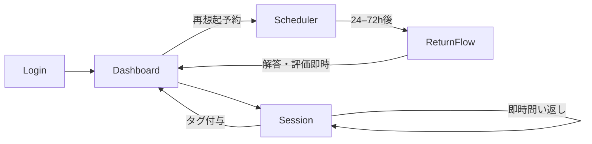

# 要件定義書

- [要件定義書](#要件定義書)
  - [1. 目的・背景](#1-目的背景)
  - [2. スコープ](#2-スコープ)
    - [2.1 対象範囲（In Scope）](#21-対象範囲in-scope)
    - [2.2 非対象範囲（Out of Scope）](#22-非対象範囲out-of-scope)
    - [2.3 前提条件・制約](#23-前提条件制約)
    - [2.4 依存関係](#24-依存関係)
  - [3. 利害関係者・体制](#3-利害関係者体制)
    - [3.1 ステークホルダー一覧](#31-ステークホルダー一覧)
  - [4. 用語定義・略語](#4-用語定義略語)
  - [5. 現状（As-Is）と将来像（To-Be）](#5-現状as-isと将来像to-be)
  - [6. ユーザーと利用シナリオ](#6-ユーザーと利用シナリオ)
    - [6.1 ペルソナ](#61-ペルソナ)
    - [6.2 ユースケース](#62-ユースケース)
  - [7. 業務ルール・ドメイン要件](#7-業務ルールドメイン要件)
  - [8. 機能要件](#8-機能要件)
    - [8.1 要件一覧（機能要求）](#81-要件一覧機能要求)
    - [8.2 画面一覧（Screen List）](#82-画面一覧screen-list)
    - [8.3 画面要件（各画面ごとに作成）](#83-画面要件各画面ごとに作成)
    - [8.4 API 要件](#84-api-要件)
    - [8.5 バッチ／ジョブ／スケジュール](#85-バッチジョブスケジュール)
    - [8.6 通知要件（メール／SMS／Push）](#86-通知要件メールsmspush)
    - [8.7 外部連携](#87-外部連携)
  - [9. 非機能要件](#9-非機能要件)
    - [9.1 信頼性・可用性](#91-信頼性可用性)
    - [9.2 性能・スケーラビリティ](#92-性能スケーラビリティ)
    - [9.3 セキュリティ](#93-セキュリティ)
    - [9.4 プライバシー・法令・コンプライアンス](#94-プライバシー法令コンプライアンス)
    - [9.5 運用性・可観測性](#95-運用性可観測性)
    - [9.6 互換性・対応環境](#96-互換性対応環境)
    - [9.7 災害対策・バックアップ](#97-災害対策バックアップ)
  - [10. データ要件](#10-データ要件)
    - [10.1 データモデル（エンティティ定義）](#101-データモデルエンティティ定義)
  - [11. 画面遷移・状態遷移（ダイアグラム）](#11-画面遷移状態遷移ダイアグラム)
  - [12. アーキテクチャ・インフラ](#12-アーキテクチャインフラ)
    - [12.1 システム構成（高位）](#121-システム構成高位)
    - [12.2 環境](#122-環境)
    - [12.3 ネットワーク・セキュリティ](#123-ネットワークセキュリティ)
    - [12.4 CI/CD・ブランチ戦略](#124-cicdブランチ戦略)
    - [12.5 ドメイン・証明書](#125-ドメイン証明書)
    - [12.6 キャッシュ戦略](#126-キャッシュ戦略)
    - [12.7 技術スタック](#127-技術スタック)

## 1. 目的・背景

- 背景：学習者は「分かったつもり」を自覚しにくい。AIを“生徒”に見立て、利用者に説明させ、AIは**採点せず1点深掘りの問い**を返すことでメタ認知を促す。
- 目的：ユーザーの知識の穴を，生徒AIの質問に答える過程で発見する．ユーザーの苦手・誤解している分野を自動管理，再質問することで，長期定着化を図る．

## 2. スコープ

### 2.1 対象範囲（In Scope）

- 説明入力、即時の問い返し（採点なし・1〜2問/ラウンド），テキストベース
- 誤解タグ抽出・可視化（定義/条件/境界/根拠/手順 など）
- *時間差の“再想起”タスク（ミニ問い）**の配信（Web Push/メール）
- ダッシュボード（タグ推移、次アクション、再出題キュー）
- 管理画面（テンプレート、タグ辞書、A/B設定）

### 2.2 非対象範囲（Out of Scope）

- 画像・動画や音声は対象外
- BtoB向けのサービス（ユーザーの管理）

### 2.3 前提条件・制約

- Webアプリケーション．将来的にはスマホアプリ化したいが，ハッカソン内ではWebに留める
- クラウドサービスを使用．Azure，もしくは，AWSを検討．
- 開発言語は，フロントエンドはNode系，バックエンドはPython．
- 生成AIのAPIは，Azureで用意されているものを使用．
- 日本語のみサポート．

### 2.4 依存関係

- 通知基盤（Web Push, E-mail）
- 認証（Google，メールアドレス）

## 3. 利害関係者・体制

### 3.1 ステークホルダー一覧

| 役割 | 氏名 | 組織 | 責務 |
| --- | --- | --- | --- |
| 全部頑張る人 | 横内佑哉・渡瀬友裕 |  | 全部 |

## 4. 用語定義・略語

| 用語 | 定義 |
| --- | --- |
| 役割反転 | AI＝生徒、ユーザー＝先生として説明→問い返しを行う方針 |
| 誤解タグ | 対話から抽出する誤解の類型（定義/条件/境界/根拠/手順 等） |
| 再想起タスク | 時間差で提示するミニ問い。正誤返却は即時、再出題のみ時間差 |
| 自己評価 | 生徒AIとの会話中，会話トピックに対して，自分の理解度を自己評価する仕組み． |

## 5. 現状（As-Is）と将来像（To-Be）

- As-Is： 正解提示型に偏り、メタ認知と長期保持の支援が弱い。
- To-Be： 説明→即時の問い返し→タグ化→**間隔反復による再想起**→解消確認、の循環UX。

## 6. ユーザーと利用シナリオ

### 6.1 ペルソナ

| ID | 概要 | 主要ニーズ | 利用頻度 |
| --- | --- | --- | --- |
| P-01 | 高3理系、模試偏差値55 | よく理解していない分野を強化したいが，どこがわからないかわからない． | 1日3~5回(スキマ時間) |

### 6.2 ユースケース

| UC-ID | 名称 | アクター | 概要 | 事前条件 | 事後条件 |
| --- | --- | --- | --- | --- | --- |
| UC-001 | 生徒AIとの会話 | 学習者 | 生徒AIがトピックについて質問してくるので，それに回答する．この過程で自分の知識の穴を発見する．
常にわからないボタンを表示し，これを押した場合，会話を終了し，一定期間後に再質問する．会話終了後に自己評価ボタンを表示する． | ログイン済 | 会話トピックについて，回答・自己評価から理解度を求めて，タグとして付与． |
| UC-002 | 再想起 | 学習者 | UC-001である一定の閾値を下回っていた場合，再度質問を行う． | UC-001である一定の閾値を下回っていた場合 | 回答をもとに理解度を再評価し，タグを更新 |
| UC-003 | 学習履歴の確認 | 学習者 | 会話履歴を確認できるようにする．ChatGPTのようなUIを想定。 | ログイン済 |  |
| UC-004 | 質問強制 | 学習者 | 通常ランダムや時間指定で生徒AIから送られてくる質問を、即時生成する。それ以降はUC-001と同じ。 | ログイン済 | 会話トピックについて，回答・自己評価から理解度を求めて，タグとして付与． |

## 7. 業務ルール・ドメイン要件

- 通知制御：基本は8:00~18:00までのランダムな時間に生徒AIから質問．

**B2Cサブスク（学習者向け）**

| プラン | 料金（月額） | 可能な質問数 | 時間指定 | 即時質問 |
| --- | --- | --- | --- | --- |
| **Basic** | 無料 | 2回/日 | 🙅‍♀️ | 広告を見れば2回まで可能 |
| **Pro** | ￥680 | 5回/日(設定可能) | 🙆‍♂️ | 10回 |

## 8. 機能要件

### 8.1 要件一覧（機能要求）

| REQ-ID | 名称 | 説明 | 優先度(MUST/SHOULD/MAY) | 備考 |
| --- | --- | --- | --- | --- |
| REQ-001 | 会員登録 | メール＋パスワードで登録 | MUST | Googleでログイン化 |
| REQ-002 | 生徒AIとの会話 | ユーザーに説明を促すAI | MUST |  |
| REQ-003 | 通知 | BeReal的な通知をWebPushあるいはメールに送信 | SHOULD | ランダム化と時間指定 |
| REQ-004 | 誤解タグ化 | 対話から理解度を求めて，タグを生成 | MUST |  |
| REQ-005 | わからないボタン | REQ-010に関連．わからない質問が来た場合，わからないボタンを押せるようにする．その場合，再質問を行う． | SHOULD |  |
| REQ-006 | 自己評価 | 会話が一通り終了した際に自己評価を行う．タグに反映される． | MAY |  |
| REQ-007 | 履歴一覧 | ChatGPT-likeなUIで過去の会話を管理． | MUST |  |
| REQ-008 | 設定 | 出題範囲の科目・分野，レベル感の指定．テーマ．通知の時間など． | MUST |  |
| REQ-009 | 質問強制 | 履歴一覧ページで新規チャットを作成するイメージ．即座に生徒AIが質問をしてくれる． | SHOULD | 科目・分野の絞り込みをつけるかは要検討 |
| REQ-010 | 再想起 | タグの理解度が閾値以下の場合，一定期間後にその分野について再質問する． | MUST |  |
| REQ-011 | 実績・トロフィー | ユーザーの学習進捗をお祝いする． | MAY |  |

### 8.2 画面一覧（Screen List）

| SCR-ID | 名称 | URL/ルーティング | 概要 | 主要操作 | 備考 |
| --- | --- | --- | --- | --- | --- |
| SCR-001 | ログイン | /login | Google/メールアドレスでログイン． | ログイン/パスワード |  |
| SCR-002 | 履歴画面 | / | チャット履歴が見れる | 過去チャット，設定，実績画面への遷移．即時質問の開始． |  |
| SCR-003 | チャット画面 | /chats/:hash | 生徒AIとユーザーの会話 | テキスト送信，わからないボタン，自己評価 |  |
| SCR-004 | 設定 | /settings | 設定を記述 | トグル，チェックボックスなど． |  |

### 8.3 画面要件（各画面ごとに作成）

- 対象：SCR-XXX
    - 目的：
    - 入力項目：フィールド名／型／必須／制約／プレースホルダ／エラー文言
    - 出力・表示：
    - UIコンポーネント：ボタン、リンク、モーダル、トースト等
    - アクセシビリティ：ラベル、フォーカス順、キーボード操作
    - バリデーション：同期／非同期、入力規則
    - 状態・遷移：ロード中・成功・失敗
    - エラーハンドリング：コード／メッセージ／再試行方針

### 8.4 API 要件

| API-ID | エンドポイント | メソッド | 概要 | 認証/認可 | リクエスト | レスポンス | エラー | レート制限 | バージョン |
| --- | --- | --- | --- | --- | --- | --- | --- | --- | --- |
| API-001 | /api/v1/auth/login | POST | ログイン | OAuth2/OIDC | JSON schema | JSON schema | 一覧 | 100 rpm | v1 |

### 8.5 バッチ／ジョブ／スケジュール

| JOB-ID | 名称 | トリガー | 頻度 | SLA | 再実行 |
| --- | --- | --- | --- | --- | --- |

### 8.6 通知要件（メール／SMS／Push）

| NTF-ID | 種別 | テンプレートID | 言語 | 配信条件 | 退会・オプトアウト |
| --- | --- | --- | --- | --- | --- |

### 8.7 外部連携

| INT-ID | 相手システム | 方式 | 認証 | タイムアウト/再試行 | フォーマット | 責任分界点 |
| --- | --- | --- | --- | --- | --- | --- |
| INT-001 | なにかしらの認証システム |  |  |  |  |  |

## 9. 非機能要件

### 9.1 信頼性・可用性

- 稼働率99.9%，RPO 15分，RTO 30分

### 9.2 性能・スケーラビリティ

- 想定負荷：同時接続 < 200
- ユーザが増えてきたら，冗長化で負荷分散（クラウドサービスを活用）．

### 9.3 セキュリティ

- 認証・認可については，なるべく信頼できる外部システム（クラウド）を使うことにして，自分で実装しない．
- プロンプトインジェクションの対策．

### 9.4 プライバシー・法令・コンプライアンス

- 個人情報保護法（APPI）への準拠．
- 未成年が利用する際の保護者の同意
- Cookie同意管理

### 9.5 運用性・可観測性

- 監視（メトリクス／ログ／トレース）、主要SLOとアラート閾値、ダッシュボード、運用手順（ランブック）

### 9.6 互換性・対応環境

- Chrome, Edge, Firefox, Safariは対応．

### 9.7 災害対策・バックアップ

- 毎日スナップショット、7日保持

## 10. データ要件

### 10.1 データモデル（エンティティ定義）

| ENT-ID | 名称 | 説明 | 主キー | 属性 | 型 | 必須 | 制約/バリデーション | 備考 |
| --- | --- | --- | --- | --- | --- | --- | --- | --- |
| ENT-001 | User | 会員 | user_id | email, password_hash, ... |  | 必須 | 一意制約 等 |  |

## 11. 画面遷移・状態遷移（ダイアグラム）

- 画面遷移図（例：Mermaid/PlantUML を利用）

## 12. アーキテクチャ・インフラ

### 12.1 システム構成（高位）

- **アプリ本体**：Next.js（React/TypeScript, App Router）を **Azure Container Apps** 上で SSR 運用する。
- **サーバ機能**：外部APIは公開しない。Next.js の **Route Handler/Server Actions** がサーバ側処理（問い返し生成、誤解タグ付与、再想起ジョブ登録、レポート生成）を担う。クライアントは同一オリジンに対して HTTP リクエストを行うのみとする。
- **認証/ID**：Auth.js（NextAuth v5）＋ **Microsoft Entra External ID**。セッションは JWT 戦略、サーバ側でトークンを扱い、ブラウザにはセッションクッキーのみを保持する。
- **ジョブ/スケジュール**：**Azure Container Apps Jobs** による Cron 実行（再想起タスク配信・再試行・DLQ ハンドリング）。
- **データベース**：Azure Database for **PostgreSQL Flexible Server**。
- **ストレージ**：Azure Blob Storage（ローカルは Azurite）。
- **構成管理**：Azure App Configuration（Feature Manager で段階リリース/A/B 切替）。
- **機密情報**：Azure Key Vault（ローカルは `.env`）。
- **ビルド/開発ツール**：開発は **Turbopack**、本番ビルドは **Next.js 既定（SWC/webpack）**。

### 12.2 環境

- **Dev/Stg/Prod** を分離。コンテナイメージはタグ運用し、各環境へ昇格デプロイする。
- Feature Flag で機能を段階有効化。Secrets/接続情報は Key Vault で集中管理。

### 12.3 ネットワーク・セキュリティ

- **入口**：Azure Front Door（または WAF 付 LB）＋ TLS1.3。HSTS 有効化、CSP/COOP/COEP を設定。
- **内部**：DB/Storage は Private Endpoint 接続。アプリからの Outbound は最小化。
- **アプリ保護**：NextAuth の CSRF/PKCE/State/Nonce 既定保護を有効。Route Handler では **zod/valibot** で入力検証を行い、レート制限（IP/ユーザ）を適用。

### 12.4 CI/CD・ブランチ戦略

- **GitHub Actions**：ビルド（Next.js）→ コンテナ化 → セキュリティスキャン → **ACA** へデプロイ。
- **リリース**：Container Apps の**リビジョン**／ブルーグリーンを活用。DB マイグレーション（Prisma/Kysely）はデプロイ時に安全実行。
- **ブランチ**：GitHub Flow。main 保護／PR 必須／プレビュー環境（Stg）を自動生成。

### 12.5 ドメイン・証明書

- カスタムドメインを Front Door/App Gateway に割当て、**証明書は Azure 管理で自動更新**。
- HSTS（preload 検討）、OCSP Stapling を有効化。

### 12.6 キャッシュ戦略

- **静的資産**：CDN キャッシュ＋長期 TTL、ハッシュ付与。
- **SSR**：Next.js の **Revalidation（ISR/Route Segment Config）** を利用。ページ性質に応じ `force-cache`/`no-store` を切替。
- **データ取得**：クライアントは SWR の stale-while-revalidate を採用可能だが、**機密データはサーバ経由のみ**とする。

### 12.7 技術スタック

- **フロント/サーバ統合**：Next.js（App Router, TypeScript, Tailwind）。
- **認証**：Auth.js（NextAuth v5）＋ Microsoft Entra External ID（JWT セッション、セキュアクッキー）。
- **サーバ処理**：Route Handler/Server Actions にドメインロジックを実装（外部公開 API は設けない）。
    - バリデーション：zod/valibot。
    - 認可：NextAuth の `auth()`/Middleware でルート保護、ロール/スコープはトークンクレームで判定。
- **ジョブ**：Azure Container Apps Jobs（Cron/遅延実行）で再想起配信。失敗は再試行、DLQ は Service Bus（任意導入）で吸収可能。
- **データ**：Azure PostgreSQL（ORM：Prisma or Kysely、PITR、監査）。
- **通知**：Azure Communication Services（Email）＋ Web Push（VAPID）。
- **ストレージ**：Azure Blob Storage（画像/エクスポート）。
- **観測性**：Application Insights（分散トレース/ログ/メトリクス）。
- **テスト**：**Jest + React Testing Library**（単体/結合）、**Playwright**（E2E）、**axe-core**（a11y）。
- **IaC/運用**：Terraform/Bicep、App Configuration（Feature Flag）、Key Vault、Front Door/WAF。